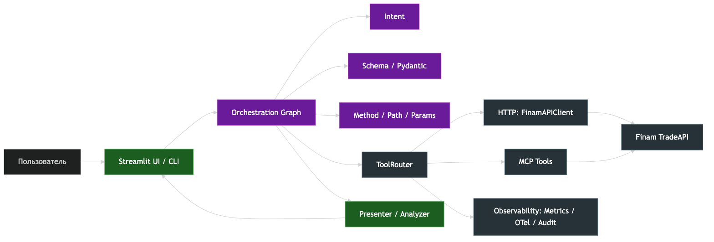
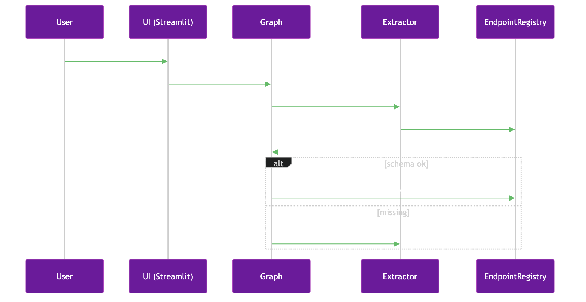
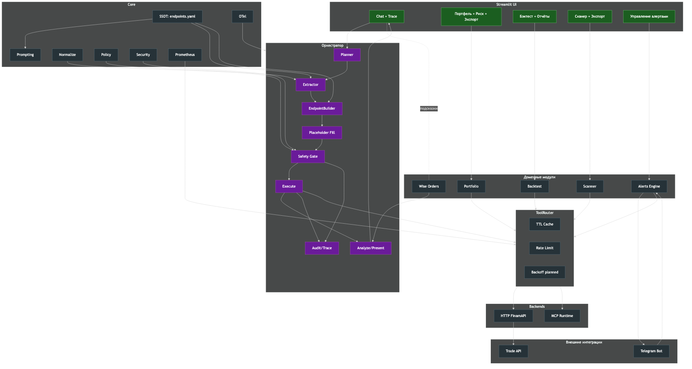

# Trader AI Assistant — Finam x HSE Hack (Prize-winning build)

> **AI‑ассистент трейдера** на базе Finam TradeAPI
> Production‑quality сборка, занявшая призовое место на хакатоне

> "From natural language to safe executable API calls — with portfolio, scanner and backtests in one UI."

## ✨ Highlights

- 🔁 **NL→API за 1 шаг**: intent, параметры и корректный METHOD/PATH без костылей
- 🛡️ **Safety‑by‑Design**: confirm‑карточка перед POST/DELETE, policy reasons, аудит
- 📚 **SSOT‑реестр**: `configs/endpoints.yaml` как единый источник правды (UI = Leaderboard)
- 🧩 **Ширина покрытия**: Портфель (sunburst/benchmark), Сканер (shortable), Бэктест (пресет+кастом), Алерты
- 📈 **Observability**: trace стадий, метрики, кэш TTL, rate‑limit

## 🧭 Архитектура (коротко)

- Взаимодействие пользователя с Trade API



---

- Архитектуры оркестратора



---

-- Полная архитектура проекта



---

## 🎥 Demo и презентация

- 📄 Исходная задача [`docs/pitch/TRADER.pdf`](docs/pitch/TRADER.pdf)
- 🎞️ PPTX‑версия питча: [`docs/pitch/ai_trade.pptx`](docs/pitch/ai_trade.pptx)

## 🎯 Задача

Создать AI-ассистента, который преобразует вопросы на естественном языке в HTTP запросы к Finam TradeAPI.

**Пример:**
- Вопрос: *"Какая цена Сбербанка?"*
- API запрос: `GET /v1/instruments/SBER@MISX/quotes/latest`

Запрос считается правильным, если полностью совпал с эталоном (и HTTP метод, и путь).

## 📁 Структура проекта

```
├── src/app/
│   ├── adapters/          # Finam API клиент
│   ├── core/              # Основная логика (LLM, config)
│   └── interfaces/        # UI (Streamlit, CLI)
├── scripts/               # Утилиты
│   ├── generate_submission.py
│   ├── validate_submission.py
│   └── calculate_metrics.py
├── data/processed/
│   ├── train.csv         # 100 обучающих примеров
│   ├── test.csv          # 300 тестовых вопросов
│   └── submission.csv    # Ваши предсказания
└── docs/                 # Документация хакатона
```

Короткая разбивка по модулям

- src/app/orchestration: планирование → экстракция → safety → исполнение через `ToolRouter`
- src/app/registry: `EndpointRegistry` (SSOT), классификация путей, подсказки политик
- src/app/leaderboard/offline_map.py: детерминированный NL→API маппер без LLM
- src/app/core: конфигурация (`config.py`), вызовы LLM, нормализации, политика, метрики
- src/app/interfaces: `chat_app.py` (Streamlit UI), `chat_cli.py`
- src/app/backtest, scanner, portfolio, alerts: функциональные блоки (бэктест, сканер, портфель, алерты)
- scripts: `generate_submission.py` (LLM), `generate_submission_offline.py` (оффлайн), `evaluate.py`

## 🔑 Необходимые API ключи

1. **OpenRouter API** (обязательно)
   - Регистрация: https://openrouter.ai/
   - Используется для LLM (GPT-4o-mini, GPT-4o, Claude и др.)

2. **Finam TradeAPI** (опционально для чата)
   - Документация: https://tradeapi.finam.ru/
   - Нужен только для работы с реальным API в чат-интерфейсе


Подробности: см. архитектурные материалы в `docs/` (диаграммы, policy, SSOT)

## 🚀 Быстрый старт

### Быстрая оффлайн‑проверка (репозиторий)

Для сабмита в формате репозитория (без Docker) доступны оффлайн‑скрипты:

```bash
python3.11 -m venv .venv && source .venv/bin/activate
pip install -r requirements.txt
```

### One‑liner для генерации сабмишна (форс LLM)

```bash
python3.11 -m venv .venv && source .venv/bin/activate && \
export OPENROUTER_API_KEY=YOUR_KEY && \
python scripts/generate_submission.py \
  --test-file data/processed/test.csv \
  --train-file data/processed/train.csv \
  --output-file data/processed/submission.csv \
  --num-examples 100 \
  --force-llm && \
python scripts/merge_predictions.py data/processed/test.csv data/processed/submission.csv data/processed/test_diagnostics.csv
```

Замена модели (опц.): `export OPENROUTER_MODEL="openai/gpt-4o"` (по умолчанию уже gpt‑4o).

### Вариант 1: Локально

```bash
# 1. Установите зависимости
poetry install

# 2. Настройте .env
cp .env.example .env

# 3. Запустите веб-интерфейс
poetry run streamlit run src/app/interfaces/chat_app.py

# ИЛИ CLI чат
poetry run chat-cli
```

### Полезные ссылки:
- [DEVELOPMENT.md](DEVELOPMENT.md) - подробная информация для разработки
- [docs/pitch/TRADER.pdf](docs/pitch/TRADER.pdf) - исходная задача

## 📄 Лицензия

Этот проект создан для хакатона Finam x HSE.
